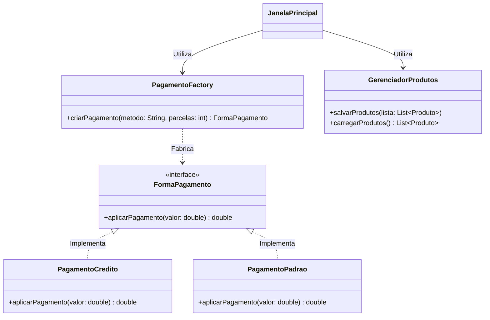

# Trabalho Prático - UC Engenharia de Software

## 1. Definição do Problema e Contexto
* **Cenário:** No cenário de plataformas de e-commerce, a retenção de clientes e o aumento de conversão de vendas dependem diretamente de campanhas de marketing eficientes, como a distribuição de cupons de desconto.
* **Problema Identificado:** O processo de validação e aplicação de cupons era acoplado diretamente ao fluxo de checkout, gerando falhas quando regras complexas de negócio (cupons expirados, cupons de primeira compra ou cumulativos) precisavam ser validadas simultaneamente.
* **Usuários Envolvidos:** Compradores (Clientes finais do e-commerce) e Administradores do Sistema (Gestores de Marketing).
* **Solução Proposta:** Um microsserviço isolado de validação de cupons (Back-end em Java) que centraliza as regras de negócio, garantindo escalabilidade, facilidade de manutenção e aplicando boas práticas de Engenharia de Software.

---

## 2. Levantamento e Análise de Requisitos (Abordagem Ágil)

### Atores Envolvidos
* **Cliente:** Deseja aplicar um cupom para obter desconto no carrinho.
* **Sistema de Checkout:** Consome a API de cupons para processar o valor final da compra.

### Backlog de Funcionalidades (User Stories)
* **US01 - Validação de Cupom Ativo:** Como Sistema de Checkout, quero validar se um cupom existe e está dentro do prazo de validade, para evitar o uso de descontos expirados.
* **US02 - Cálculo de Desconto Fixo:** Como Cliente, quero que um cupom de valor fixo (ex: R$ 20,00) seja deduzido do meu saldo total.
* **US03 - Cálculo de Desconto Percentual:** Como Cliente, quero que um cupom de valor percentual (ex: 10%) seja aplicado sobre o valor total da compra.

---

## 3. Arquitetura e Engenharia de Software

### Princípios SOLID Aplicados
* **SRP (Single Responsibility Principle):** A classe `CalculadoraDesconto` possui a única responsabilidade de orquestrar a aplicação das regras de cálculo, enquanto a entidade `Produto` gerencia os dados do item.
* **OCP (Open/Closed Principle):** A introdução de novos tipos de cupons (ex: Frete Grátis) não exige a modificação do código existente, bastando criar uma nova implementação da interface `RegraDesconto`.
* **DIP (Dependency Inversion Principle):** O serviço de checkout depende da abstração (`RegraDesconto`) e não de implementações concretas.

### Padrão de Projeto Utilizado
* **Strategy (Comportamental):** Utilizado para alternar dinamicamente o algoritmo de cálculo de desconto (Fixo ou Percentual) baseado no tipo de cupom fornecido em tempo de execução.
* **Simple Factory:** Utilizado na classe `DescontoFactory` para centralizar e isolar a lógica de criação das estratégias concretas, eliminando o acoplamento de instanciação nas camadas de execução.

---
## Instruções para Execução da Aplicação

Este projeto foi desenvolvido utilizando o padrão de gerenciamento de dependências do **Maven** e o **Java 23 (OpenJDK)**. Siga os passos abaixo para clonar, compilar e rodar os testes da aplicação em sua máquina local.

### Pré-requisitos
Antes de iniciar, certifique-se de ter instalado em sua máquina:
* **Java JDK 23** ou superior.
* **Apache Maven 3.9.x** ou superior.
* Variável de ambiente `JAVA_HOME` configurada apontando para a raiz do seu JDK (sem a pasta `\bin` no final).

### Passo a Passo

 **1 Clonar o Repositório:**
   Abra o seu terminal e execute o comando abaixo para clonar o projeto:
   git clone [https://github.com/fellipe0244/TrabalhoA3Lucas202601.git](https://github.com/fellipe0244/TrabalhoA3Lucas202601.git)

**2 Compilar o Projeto:**
    terminal > mvn clean compile

**3 Executar a Interface Interativa (CLI):**
    execute testes na classe Main

**3 Executar testes automatizados**
    terminal > mvn test

## Modelagem da Solução (Diagrama de Classes)

## 4. Modelagem da Solução (Diagrama de Classes)


## Demonstração de Funcionamento (Logs da Aplicação)

Como a solução desenvolvida é um componente de back-end focado em regras de negócio acopláveis (Microsserviço de Cupons), o seu comportamento, regras de validação e execução prática são demonstrados por meio da suíte de testes automatizados. 

Ao executar o comando `mvn test`, a aplicação valida os seguintes cenários de negócio em tempo de execução:

1. **Cenário 1 (`deveAplicarDescontoFixoCorretamente`):** Valida se um cupom de valor fixo (ex: R$ 20,00) reduz corretamente o saldo total de uma compra de R$ 100,00, retornando o valor esperado de R$ 80,00.
2. **Cenário 2 (`deveGarantirQueDescontoFixoNaoDeixeValorNegativo`):** Regra de segurança que garante que se um cupom de R$ 50,00 for aplicado em uma compra de R$ 10,00, o sistema barra valores negativos e fixa o total do carrinho em R$ 0,00.
3. **Cenário 3 (`deveAplicarDescontoPercentualCorretamente`):** Valida a estratégia de porcentagem (ex: 10%), aplicando-a sobre uma compra de R$ 200,00 e garantindo o retorno correto de R$ 180,00.

### Log de saida do console, execução interativa (Classe Main):

```text

   SIMULADOR DE CHECKOUT INTERATIVO - CUPONS           


Digite o nome do produto: PlayStation 5 Slim
Digite o valor original do produto (Ex: 150,00): 3800,00

--- Escolha o tipo de cupom ---
[1] FIXO (Desconto em Reais)
[2] PERCENTUAL (Desconto em %)
Opção desejada: 2
Digite o valor do cupom (Ex: 15 para 15% ou 15 Reais): 10

               PROCESSANDO SIMULAÇÃO                   

[INFO] [CalculadoraDesconto] Processing cupom para o produto: 'PlayStation 5 Slim'
[INFO] [CalculadoraDesconto] Iniciando processo de validação de cupom.
[INFO] [CalculadoraDesconto] Valor original do carrinho: R$ 3800,00
[INFO] [CalculadoraDesconto] Estratégia 'DescontoPercentual' aplicada com sucesso.
[INFO] [CalculadoraDesconto] Valor final com desconto: R$ 3420,00
[INFO] [CalculadoraDesconto] Processo finalizado.

```
### Logs de Saida de Testes Automatizados (mvn test):

```text

[INFO] Running br.com.ecommerce.cupom.CalculadoraDescontoTest

=== [TESTE PARAMETRIZADO] iPhone 15 Pro Max com desconto de R$ 500,00 ===
[INFO] [CalculadoraDesconto] Processing cupom para o produto: 'iPhone 15 Pro Max'
[INFO] [CalculadoraDesconto] Iniciando processo de validação de cupom.
[INFO] [CalculadoraDesconto] Valor original do carrinho: R$ 7500,00
[INFO] [CalculadoraDesconto] Estratégia 'DescontoFixo' aplicada com sucesso.
[INFO] [CalculadoraDesconto] Valor final com desconto: R$ 7000,00
[INFO] [CalculadoraDesconto] Processo finalizado.


=== [TESTE PARAMETRIZADO] Headphone Sony com desconto de R$ 200,00 ===
[INFO] [CalculadoraDesconto] Processing cupom para o produto: 'Headphone Sony'
[INFO] [CalculadoraDesconto] Iniciando processo de validação de cupom.
[INFO] [CalculadoraDesconto] Valor original do carrinho: R$ 2000,00
[INFO] [CalculadoraDesconto] Estratégia 'DescontoFixo' aplicada com sucesso.
[INFO] [CalculadoraDesconto] Valor final com desconto: R$ 1800,00
[INFO] [CalculadoraDesconto] Processo finalizado.


=== [TESTE PARAMETRIZADO] Mouse Gamer com desconto de R$ 50,00 ===
[INFO] [CalculadoraDesconto] Processing cupom para o produto: 'Mouse Gamer'
[INFO] [CalculadoraDesconto] Iniciando processo de validação de cupom.
[INFO] [CalculadoraDesconto] Valor original do carrinho: R$ 300,00
[INFO] [CalculadoraDesconto] Estratégia 'DescontoFixo' aplicada com sucesso.
[INFO] [CalculadoraDesconto] Valor final com desconto: R$ 250,00
[INFO] [CalculadoraDesconto] Processo finalizado.


=== [TESTE PARAMETRIZADO] Teclado Mecânico com desconto de R$ 200,00 ===
[INFO] [CalculadoraDesconto] Processing cupom para o produto: 'Teclado Mecânico'
[INFO] [CalculadoraDesconto] Iniciando processo de validação de cupom.
[INFO] [CalculadoraDesconto] Valor original do carrinho: R$ 150,00
[INFO] [CalculadoraDesconto] Estratégia 'DescontoFixo' aplicada com sucesso.
[INFO] [CalculadoraDesconto] Valor final com desconto: R$ 0,00
[INFO] [CalculadoraDesconto] Processo finalizado.

[INFO] Tests run: 7, Failures: 0, Errors: 0, Skipped: 0, Time elapsed: 0.115 s -- in br.com.ecommerce.cupom.CalculadoraDescontoTest
[INFO] 
[INFO] Results:
[INFO] 
[INFO] Tests run: 7, Failures: 0, Errors: 0, Skipped: 0
[INFO] ------------------------------------------------------------------------
[INFO] BUILD SUCCESS

```


